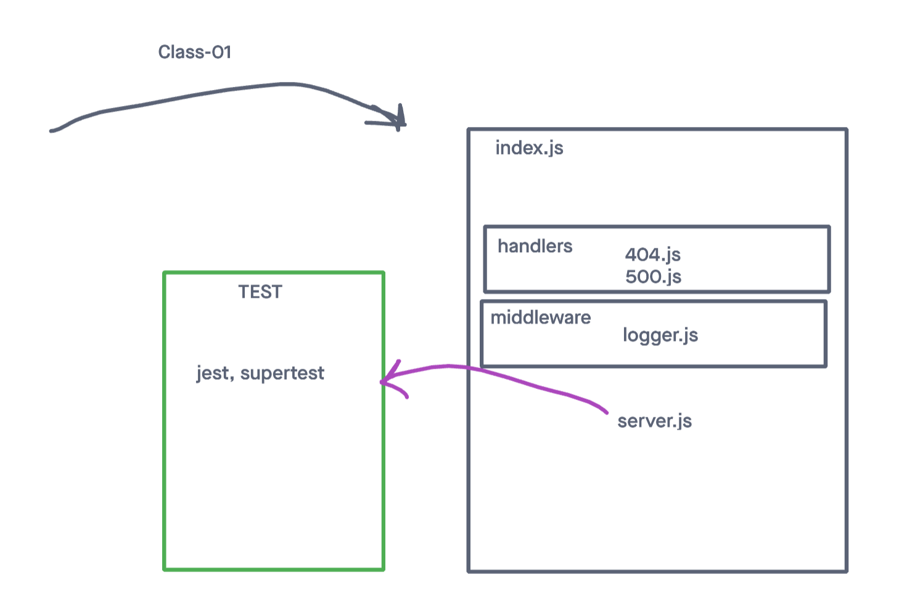

# LAB - Class 01

## Project: Server Deployment Practice

### Author: Megan Seibert-Hughes

### Problem Domain
To create and deploy a web server using CI and CD and become used to the overall process of building and deploying servers.

### Links and Resources
[ci/cd](https://github.com/maefae/server-deployment-practice/actions) (GitHub Actions)
[Prod Deployment - back]()
[Dev Deployment - front]()

### Setup

#### .env requirements

see `.env.sample`
- PORT: 3001

#### How to initialize/run your application
nodemon

#### Features / Routes

- Feature One: Deploy to Dev
- GET : `/` - specific route to hit
- GET : `bad` - specific route to hit

- Feature Two: Deploy to Prod
GET : `/hello` - specific route to hit
GET : `bad` - specific route to hit

#### Tests
- How do you run tests?
  - npm test
- Any tests of note?
  - handles root path
  - handles invalid requests
  - handles errors

### UML

